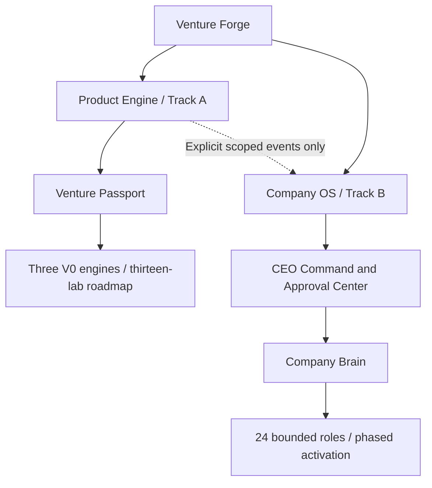
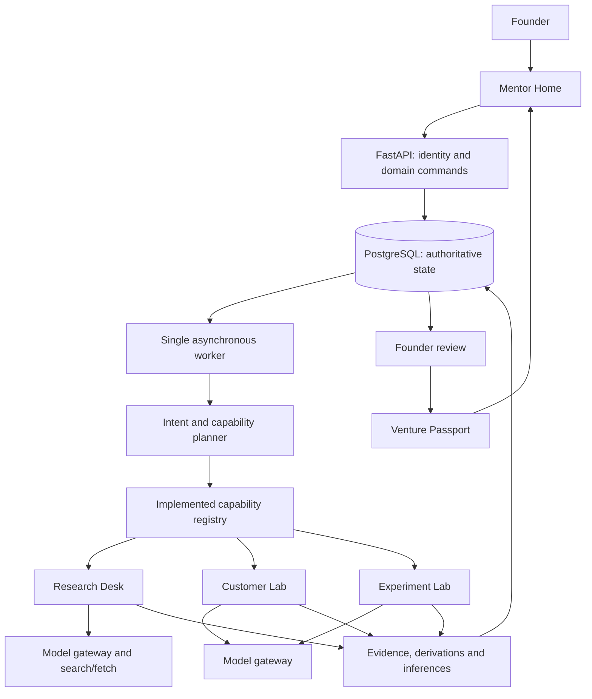
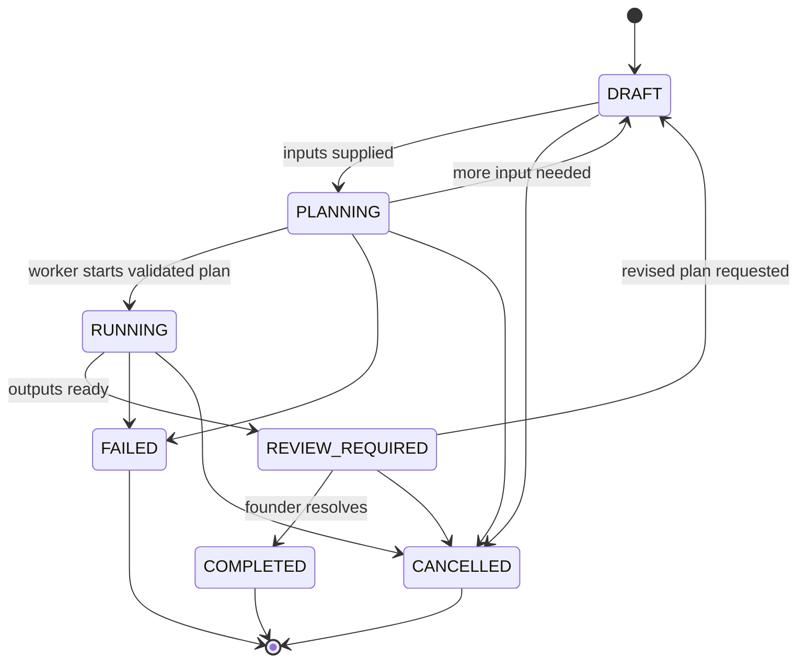

# Venture Forge implementation plan

Implementation update, 5 October 2026: `venture-forge/` now executes all thirteen specialists from the supplied specialist PDF, with five connected journeys, founder review gates and Passport handoffs. See [current build status](venture-forge/docs/build-status.md) and [specialist guide](venture-forge/docs/specialist-pipelines.md). The planning text below remains a reference; Company OS and institutional roles are not activated.

Model architecture: **Specialist → capability requirements → Model Router → provider adapter → validated structured analysis → founder review → Venture Passport**. Hybrid routing prefers capable cloud profiles for complex tasks, offers optional local-only Ollama processing, and keeps calculations, scoring, validation and workflows deterministic. All thirteen agents declare requirements without a vendor binding. OpenAI, Anthropic, Gemini and Ollama adapters use server-side credentials, context/privacy/cost admission and source validation. See [configuration and implemented boundaries](venture-forge/docs/model-routing.md).

The architecture selection uses this custom answer:

> Provider-agnostic hybrid model layer. Cloud LLM APIs as the default for complex reasoning, with API keys stored server-side only; Ollama/local models as an optional privacy/offline provider; deterministic tools for calculations, validation, scoring, rules, and workflows. Each specialist agent must declare its model requirements, and the orchestration layer should select the appropriate provider/model per task. Do not hard-code any agent to a single model vendor.

Models primarily synthesize evidence and assess hypotheses. Synthesis tasks must provide both fields and verified source claims when original text is available; generic explanations are insufficient. Python controls retrieval/provenance, arithmetic, validation and workflow state. Model conclusions stay labelled as inference and cannot validate a hypothesis without recorded observations and founder decisions.

FinancePilot additionally calculates CAC, revenue/gross-profit LTV, runway, gross margin, cash change and ending cash with explicit Decimal-based functions. Its result contract checks calculated figures against the stored drivers. Missing customer inputs remain unknown. See [Finance Lab definitions and units](venture-forge/docs/finance-tools.md).

Revised: 3 October 2026, Asia/Kolkata. Version 3: Product Engine and Company OS. Status: VF-001 through VF-007 implemented and verified locally; Product V0 and Company OS activation follow the gates below.

Venture Forge has two independent but connected systems: the **Product Engine**, which helps customers build ventures through their Venture Passports, and **Company OS**, which operates Venture Forge through a separate Company Brain and CEO Approval Center. Shared infrastructure grants neither shared records nor shared authority.

Track A remains the first priority. Build Product V0 for one founder and one venture through **Research Desk, Customer Lab, and Experiment Lab**. Mentor Home orchestrates capabilities; the Venture Passport preserves hypotheses, observations, calculations, interpretations, preferences, and founder decisions. Track B begins after that loop produces a real founder decision, starting with executive visibility and then approved communications.



Sections 2-14 describe Track A. Sections 16-22 define Track B and the joint delivery sequence. A customer Finance Lab cannot modify company accounts; a company Finance Controller cannot modify a customer's Passport.

The product hypothesis is that founders will repeatedly use this workflow because evidence and experiments improve their next action. Reports and completed onboarding alone do not establish product value.

```text
Idea -> Hypothesis -> Research -> Customer evidence -> Experiment
     -> Observed result -> Founder decision -> Updated Venture Passport
```

The previous six-lab, 12-week estimate mixed product validation with production infrastructure. This revision separates prototype, alpha, private beta, and production pilot. Additional infrastructure and labs must earn their complexity through observed needs.

## 1. Independent implementation boundary

The inspected reference workspace is Agents Office 3.2.1-beta.2 according to its package manifest. `build.mjs` bundles the office UI, `serve.mjs` routes to department agents and retrieves notes by word overlap, and `roster.mjs` fixes departments and seats. These observations describe the local project, not Venture Forge or later upstream releases.

The local [LICENSE](LICENSE) restricts rebranding and adapting Agents Office to front another product. Create Venture Forge in a new repository with original code, assets, schemas, UI, playbooks, and branding. Preserve this reference and its notices. Do not import its modules, scene, roster, sample business notes, or build output. Record new dependency licenses.

Founder-owned imports require provenance and review. Synthetic examples are labelled and excluded from product metrics.

## 2. V0 scope and learning gate

V0 includes one authenticated founder, one venture, explicit hypotheses, a simple Passport, three engines, implemented capability routing, a single asynchronous worker, traceable evidence, frozen experiment protocols/results, founder review, structured export, and basic usefulness/cost instrumentation.

| Deferred work | V0 replacement | Promotion trigger |
| --- | --- | --- |
| Separate Problem, Market, Competitor engines | Research/Customer playbooks | Repeated distinct workflow needs |
| Ten more lab implementations | Written roadmap outside the runtime registry | Core loop produces useful repeated decisions |
| Redis/Celery and transactional outbox | One worker discovering PostgreSQL work records | Measured backlog, multiple workers, isolation or unattended recovery |
| Leases, heartbeats, dead-letter infrastructure | Visible failure and manual restart | Concurrent or unattended executors |
| Multi-tenancy and mentor roles | One founder with record ownership checks | Before a second independent founder |
| pgvector and embeddings | Relational links and PostgreSQL text search | Measured unlinked-document retrieval failure |
| Object-storage platform and broad ingestion | Private local files, pasted excerpts, bounded text/CSV imports | Remote deployment or multiple users |
| Broad connectors and external writes | One search/fetch provider; founder acts manually | Repeated need and operation-specific controls |
| Large evaluations and distributed tracing | Small reviewed fixtures, logs, usage records | Broader usage and observed failures |
| 3D Forge | Accessible dashboard and lists | Demonstrated navigation value |

Authenticate the founder, check ownership everywhere, keep secrets server-side, validate inputs, protect files, and cap calls from the start. V0 is supervised and does not promise unattended reliability. Customer observations retain consent context and restricted access.

Before alpha, ask the founder to complete at least three real hypothesis-to-decision cycles across two sessions, including one executed experiment and result. Review whether evidence changed the next action and whether the founder returned without prompting. These are proposed learning gates, not statistical benchmarks.

Report-only usage calls for improving experiment execution and review before more labs. Alpha can begin with one founder; multi-founder invitations wait for beta isolation tests.

## 3. Product V0 architecture

| Layer | V0 choice | Responsibility |
| --- | --- | --- |
| Web | Next.js, TypeScript, accessible components | Mentor Home, evidence, experiments, decisions, Passport |
| API | FastAPI, Pydantic, SQLAlchemy, Alembic | Contracts, authentication, ownership, domain commands |
| Database | PostgreSQL | Authoritative venture, mission, evidence and decision state |
| Worker | One Python process with async I/O | Read ready database work; execute one mission at a time |
| Models | One provider behind an internal gateway | Typed generation, bounded repair, timeout, usage |
| Research adapter | One search/fetch provider | Permitted capture, excerpts and metadata |
| Files | Private local directory outside public web root | Source snapshots/exports with hashes |
| Retrieval | Relational joins; text search | Hypothesis-to-evidence and decision context |
| Operations | Structured logs, usage totals, manual backups | Inspect failures and reproduce results |

Lock compatible versions at kickoff. Defer provider failover, shared UI packages, and a generic plugin framework.



Persist the mission before returning `202 Accepted`. The worker reads ready work from PostgreSQL; the UI polls status. A separate executor avoids keeping model work inside requests. This design does not guarantee automatic recovery or exactly-once execution.

FastAPI describes in-process background work and advises considering separate execution tools for heavier work. This worker is a product-specific simplification. See [FastAPI background-task guidance](https://fastapi.tiangolo.com/tutorial/background-tasks/). Python async queues coordinate in-process work; they are not persisted mission records. See [Python asyncio queue documentation](https://docs.python.org/3/library/asyncio-queue.html).

**Permanent invariant:** PostgreSQL is truth; workers execute; any future Redis queue transports jobs. Runnable work remains reconstructable from database records if transport is lost.

## 4. Typed knowledge and claims

Keep six classes: inference is essential, and calculation deserves an explicit derivation class.

| Class | Example | Interpretation |
| --- | --- | --- |
| Preference | "Keep reports short" | Presentation guidance |
| Hypothesis | "Students will pay INR 1,999 monthly" | Founder assumption to test |
| Evidence | Source excerpt, observation, purchase | Observation with provenance, scope and limitations |
| Derivation | Population multiplied by assumed segment share | Reproducible calculation with typed inputs/assumptions |
| Inference | "Price may explain low conversion" | Interpretation; does not establish causation |
| Decision | "Test INR 499 next" | Explicit founder choice |

Founder statements become hypotheses unless supplied as sourced observations. Ingestion establishes provenance, not truth. Willingness to pay differs from a purchase. AI summaries cannot independently corroborate their own sources. Accepting an inference does not transform it into evidence.

A claim stores its atomic assertion, originating record, scope, author, assessment criteria and revision:

- `claim_type`: `FACTUAL`, `CALCULATED`, `PREDICTIVE`, `INTERPRETIVE`, `FOUNDER_ASSERTED`, `CUSTOMER_REPORTED`.
- `epistemic_status`: `UNASSESSED`, `SUPPORTED`, `SUPPORTED_WITH_ASSUMPTIONS`, `PARTIALLY_SUPPORTED`, `CONTRADICTED`, `INCONCLUSIVE`, `STALE`.
- Evidence relationships: `supports`, `contradicts`, `contextualizes`; links alone do not certify an assessment.

`FACTUAL` describes assertion type, not proven truth. `CALCULATED` requires a derivation; predictive/interpretive claims retain inference provenance; founder assertions link to hypotheses; customer reports link to actual observations. Validate type/origin compatibility.

The canonical enum explicitly includes `SUPPORTED_WITH_ASSUMPTIONS`: a derivation follows from stated inputs, while assumptions may remain unvalidated.

Synthetic example; these inputs are invented, not market evidence:

```json
{
  "id": "CL-SYNTH-001",
  "claim_type": "CALCULATED",
  "epistemic_status": "SUPPORTED_WITH_ASSUMPTIONS",
  "statement": "The illustrative eligible population is 2,000,000.",
  "origin": {"record_type": "derivation", "record_id": "DR-SYNTH-001"},
  "derivation": {
    "formula": "population * assumed_target_share",
    "formula_version": "1.0",
    "inputs": [
      {"name": "population", "value": 20000000, "unit": "people", "provenance": "synthetic_fixture"},
      {"name": "assumed_target_share", "value": 0.1, "unit": "ratio", "provenance": "unvalidated_assumption"}
    ],
    "output": {"value": 2000000, "unit": "people"}
  },
  "synthetic": true
}
```

Assess directness, method, relevance, recency, independence and contradictions qualitatively. Do not turn model confidence into a success probability or global score.

## 5. Minimal records and persistence

Use UUIDs, UTC timestamps, decimal money with currency/units, and revision checks. Example IDs are readable symbols. Venture-owned records carry founder/venture ownership; relationships cannot cross ventures.

| V0 record group | Required content |
| --- | --- |
| Founder, venture, preferences | Identity/owner, idea, segment, geography, focus stage, preferences, revision |
| Hypotheses | Statement, origin, importance, criteria, assessment, revision |
| Sources and versions | URL/observation reference, dates, publisher, hash, private locator |
| Evidence | Excerpt/observation locator, method, sample/context, source version, review state |
| Claims and links | Type/status, origin, assessment basis; hypothesis/evidence relationships |
| Derivations and inputs | Formula version, values/revisions, assumptions, output/units |
| Inferences and basis | Interpretation, author/model version, basis records, limitations |
| Experiments/protocols/results | Frozen protocol and actual result provenance; section 8 |
| Missions/steps | Input revision, capability plan, states, attempts, limits, output IDs |
| Decisions/change proposals | Exact change, basis, founder resolution/rationale |
| Passport snapshots | Included revisions, export/hash/date |
| Activity/usage | Actor/change/date; calls, tokens, estimated cost |

Structured JSON can hold small payloads; split tables where queries or invariants need them. Hypothesis assessments remain separate from claim assessments: `unvalidated`, `testing`, `supported`, `contradicted`, `inconclusive`, `archived`, with criteria and basis. Generated reassessments are proposed interpretations.

The Passport is a read model, not a second editable fact store. Snapshots pin revisions. Preserve source versions, frozen protocols and historical decisions when current interpretations change.

Alpha adds interviews, customer segments and graph exploration. Beta adds workspaces/memberships, mentors, connectors, checkpoints and auditing. Tenant migration updates constraints and API/worker/retrieval/export paths together; a tenant column alone is insufficient.

## 6. Capabilities before labs

```text
Request -> Intent -> Required capabilities -> Eligible implementations
        -> Validated plan -> Execution -> Founder review
```

| V0 engine | Capabilities | Output rules |
| --- | --- | --- |
| Research Desk | `secondary_research`, `problem_framing`, `competitor_comparison` | Sources/excerpts, scope, contradictions, gaps; shared problem/competitor playbooks |
| Customer Lab | `customer_interview_design`, `customer_discovery` | Protocol or actual observation synthesis; sample/consent visible |
| Experiment Lab | `experiment_design`, `experiment_result_assessment` | Protocol, result provenance, calculated outcome, separate interpretation |

Market estimation starts as a bounded Research playbook plus derivations when needed. It is not a standalone engine or automatically available general-purpose service.

Register a capability only after its implementation, schemas, permissions and fixture exist. The runtime registry contains three working engines, not thirteen placeholders. Experimental capabilities still need implementations and opt-in; the roadmap is separate.

```json
{
  "capability": "customer_discovery",
  "implementation": "customer_lab@1.0.0",
  "availability": "enabled",
  "input_schema": "customer-discovery-input.v1",
  "output_schema": "customer-discovery-output.v1",
  "playbook": "customer-discovery@1.0.0",
  "required_inputs": ["hypothesis_id", "segment", "observations"],
  "permitted_operations": ["founder_observations.read", "private_artifact.create"],
  "timeout_seconds": 180
}
```

Missing observations require interview design or founder input, not fabricated discovery. Capabilities own procedures, contracts, evidence rules, failure handling and limits. Pin versions per mission. Capabilities can move between engines without changing intent routing.

## 7. Orchestration and mission states

Inputs: request, authorized Passport revision, hypotheses, evidence, prior results, capabilities and remaining limits. Models propose plans; code resolves implementations and enforces dependencies, inputs, budgets and permissions.

Illustrative plan, assuming actual customer observations are available:

```json
{
  "schema_version": "1.0",
  "goal": "Evaluate problem demand and prepare a measurable test",
  "intent": "evaluate_problem_demand",
  "venture_id": "VEN-001",
  "passport_revision": 4,
  "hypothesis_ids": ["H-034"],
  "required_capabilities": ["secondary_research", "customer_discovery", "experiment_design"],
  "missing_inputs": [],
  "steps": [
    {"id": "research", "capability": "secondary_research", "implementation": "research_desk@1.0.0", "depends_on": []},
    {"id": "customer", "capability": "customer_discovery", "implementation": "customer_lab@1.0.0", "depends_on": []},
    {"id": "experiment", "capability": "experiment_design", "implementation": "experiment_lab@1.0.0", "depends_on": ["research", "customer"]}
  ],
  "execution": {"max_parallel_steps": 1, "max_step_attempts": 2, "max_model_calls": 8},
  "human_decision_required": true,
  "expected_artifacts": ["research_brief", "customer_synthesis", "experiment_protocol_draft"]
}
```

Reject unavailable capabilities, schema mismatch, cycles, cross-venture IDs, missing inputs and excessive calls. Without observations, substitute interview design and retain the evidence gap.



Execution/validation/synthesis phases sit beneath steps. Step states: `pending`, `running`, `succeeded`, `failed`, `cancelled`. Waiting-to-start and missing-input details are fields. Ready plans remain discoverable in `PLANNING` until the worker starts.

V0 permits one API instance and one worker. On restart, mark interrupted attempts `FAILED` and expose manual retry after the old executor is stopped. Retry creates a linked new mission attempt, preserving the failed mission's history. Reuse completed outputs only for unchanged inputs and implementation versions. Keep stable output keys, persist cancellation and reject late commits. Repeated model calls can still incur cost; bound attempts.

Do not claim automatic crash recovery or restoration of arbitrary partial model output. Beta adds checkpoints/safe redispatch. Move that dependency earlier and re-estimate if supervised retries prove inadequate.

## 8. Experiment provenance

Experiment Lab is central: it creates evidence through real tests. Research should lead toward experiments rather than report accumulation.

Before starting, record hypothesis/revision, protocol version/hash, metric/denominator, threshold, population/recruitment, sample target, planned dates, collection method, exclusions, transformations, constraints and stop rule. Founder confirmation freezes the protocol.

Experiment states: `DRAFT`, `PRE_REGISTERED`, `RUNNING`, `RESULT_RECORDED`, `REVIEWED`, `CANCELLED`; independent of mission states.

Results preserve actual dates, raw inputs/hashes, sample, excluded observations/reasons, calculation version, metric, outcome, limitations, inference and decision. Results cannot rewrite thresholds. Amendments create dated versions with whether data had been inspected; post-result reinterpretation is labelled exploratory.

Synthetic example illustrating calculation:

```json
{
  "experiment_id": "EXP-SYNTH-001",
  "hypothesis_id": "H-SYNTH-001",
  "protocol": {
    "version": 1,
    "state": "PRE_REGISTERED",
    "metric": "converted_eligible_participants / eligible_participants",
    "threshold": {"operator": ">=", "value": 0.15},
    "minimum_sample": 1000,
    "exclusion_rule": "Exclude duplicate participant records"
  },
  "result": {
    "raw_records": 1012,
    "excluded_duplicates": 12,
    "eligible_participants": 1000,
    "converted_eligible_participants": 92,
    "observed_metric": 0.092,
    "outcome": "THRESHOLD_NOT_MET"
  },
  "inference": "Price may be one explanation; the test does not isolate causation.",
  "proposed_decision": "Design a new pricing test with its own protocol.",
  "synthetic": true
}
```

Real records also require dates, raw-data locators, method and protocol hash. Outcomes: `THRESHOLD_MET`, `THRESHOLD_NOT_MET`, `INCONCLUSIVE`; insufficient sample or unreliable collection yields inconclusive. Crossing a threshold is not statistical proof; retain limitations.

The founder executes the V0 external test and enters results. Recruitment, invitations and payments are manual. Preserve execution evidence to distinguish recommendations from completed experiments.

## 9. Retrieval and founder control

For "what supports H-034?", follow relational links to claims, evidence, experiments, derivations, inferences and decisions. Include contrary findings and enforce ownership. Text search handles unlinked material initially.

Keep source dates, population/geography, excerpt/locator, version, method and limitations. Common-origin articles are not independent corroboration. Label inference in screens and exports.

Add embeddings only when representative unlinked-document queries reveal a gap semantic search improves. Relational links stay authoritative. pgvector supports exact search and documents limitations of approximate filtering; benchmark scoped recall before indexing. See [pgvector documentation](https://github.com/pgvector/pgvector#filtering).

| Level | V0 behavior | Later requirement |
| --- | --- | --- |
| 1: scoped autonomous | Research, private drafts and calculations within limits | Same principles across capabilities |
| 2: founder confirmation | Exact proposed change, basis, revision, accept/reject and rationale | Role-based permissions |
| 3: external authorization | External writes unavailable; founder acts manually | Action-specific authorization/connectors |

Level 2 commits decision/change transactionally, rejects stale revisions/replay, and records actor/time. Mission completion does not authorize undisclosed changes. V0 stage is a founder-controlled focus label, not the full lifecycle gate framework.

Future external actions need approvals bound to payload/recipient, connection, actor, scope, revision, expiry and policy. Reconcile uncertain outcomes before retries; do not promise exactly-once external effects. Defer unused external-action infrastructure.

Sources cannot modify instructions or permissions. Restrict fetching to public destinations, recheck redirects, reject private/local networks, cap size/time, and do not render active uploaded content. Keep parsing and secrets outside public paths.

## 10. APIs, screens and repository

Paths are relative to `/api/v1`; apply ownership/schema checks everywhere. Use idempotency for missions/decisions and revisions for edits. Poll status; defer SSE/event replay.

| Endpoint group | Purpose |
| --- | --- |
| `POST /ventures`; `GET /ventures/{id}/passport` | Create/read venture |
| `GET, POST /ventures/{id}/hypotheses` | Assumptions and criteria |
| `GET, POST /ventures/{id}/evidence` | Sources/observations |
| `POST /ventures/{id}/missions`; `GET /missions/{id}` | Plans, states, limits, failures |
| `POST /missions/{id}/inputs`, `POST /missions/{id}/retry`, `POST /missions/{id}/cancel` | Input, manual restart, cancellation |
| `GET, POST /ventures/{id}/experiments` | Protocol drafts/list |
| `POST /experiments/{id}/pre-register`; `POST /experiments/{id}/results` | Freeze protocol/results |
| `POST /change-proposals/{id}/resolve`; `POST /ventures/{id}/decisions` | Exact change or manual choice |
| `POST /ventures/{id}/passport/exports` | Pinned JSON/Markdown snapshot |
| `POST /missions/{id}/feedback`; `GET /capabilities` | Usefulness/implemented capabilities |

Screens: Mentor Home, hypothesis/evidence detail, mission, experiment protocol/results, founder review, Passport. Embed history; defer graph, calendar, connector, mentor and 3D screens.

Show descriptive evidence dimensions: problem, customer, market, pricing, solution, finance, traction. Link assessments and highlight critical untested assumptions. No global venture/founder score; document completeness does not prove viability.

Proposed independent structure; no implementation directories are created by this task:

```text
venture-forge/
  apps/web/                       # Next.js and generated API types
  backend/venture_forge/
    api/                          # Routes/auth
    product/                      # Product-owned context and authority
      core/
      orchestration/
      engines/                    # Research, Customer, Experiment first
      api/
    company_os/                   # Separate company context and authority
      orchestrator/
      executive/
      communications/
      sales/
      marketing/
      finance/
      operations/
      approvals/
      connectors/
      company_brain/
      events/
      policies/
    shared/                       # Stateless helpers; explicit caller context
      models/
      calculations/
      auth/
      observability/
  playbooks/product/
  playbooks/company/
  database/migrations/
  tests/
  docs/                           # Contracts/run instructions/learning log
  compose.yaml                    # PostgreSQL only for V0
```

Runtime files use a private configured directory excluded from source control/static serving. Generate types from API contracts; API/worker share domain commands.

## 11. Product delivery estimates and gates

Assume two experienced engineers, prompt founder review, available provider credentials, manual testing and no complex ingestion. These are planning ranges. Solo/part-time work requires a capacity-based re-estimate.

| Stage | Incremental estimate | Cumulative estimate | Exit gate |
| --- | --- | --- | --- |
| V0 supervised prototype | 3-5 weeks | 3-5 weeks | One founder/venture, three engines, real experiment/result/decision and repeat use |
| Alpha | 6-10 additional weeks | 9-15 weeks | Extract Problem/Market/Competitor where justified, up to six engines; richer workflow and useful repeated decisions |
| Private beta | 6-10 additional weeks | 15-25 weeks | Multi-founder isolation, recovery, selected read connectors, auditing/evaluations |
| Production pilot | 4-8 additional weeks | 19-33 weeks | Hardening, observability, restore rehearsal, cost controls, retention/support |

Cumulative totals sum Track A effort ranges and replace the earlier 12-week estimate. They exclude Company OS work and are not combined-program calendar dates. Under the sequence in section 21, intervening Company OS stages move Product Alpha's calendar date later. Re-estimate both tracks after V0 and C0; sharing engineers does not create extra capacity.

| V0 milestone | Window | Deliverable |
| --- | --- | --- |
| Foundation | Week 1 | Original repo, auth, PostgreSQL, venture/hypotheses/Passport |
| Research | Week 2 | Sources, typed claims/links, Research Desk, derivations/inferences |
| Mission and customers | Week 3 | Registry, worker, gateway, manual retry, real observations |
| Experiment and decision | Weeks 4-5 | Frozen protocol/results, founder review, export/feedback |

Three weeks requires overlap and heavily assisted functions; four-to-five is the sequential basis. Recruitment and real experiment execution may extend elapsed time. V0 is not useful until results lead to a reviewed decision.

### First-week backlog

| Item | Owner | Depends on | Acceptance |
| --- | --- | --- | --- |
| VF-001: original repo/provenance | Both | None | Independent scaffold/license record |
| VF-002: database/checks | Backend | VF-001 | PostgreSQL/migration/API checks; no Redis/outbox |
| VF-003: identity/ownership | Backend | VF-002 | Sign-in; wrong-owner/unauthenticated access denied |
| VF-004: baseline contracts | Backend | VF-002 | Venture/hypothesis/Passport, origin/revision |
| VF-005: assumption commands | Backend | VF-003, VF-004 | Statements persist as unvalidated hypotheses |
| VF-006: Mentor Home/Passport | Frontend | VF-004 | Accessible forms/errors/empty states/labels |
| VF-007: rehearsal | Both | VF-005, VF-006 | Create/reload, inspect hypotheses, verify ownership |

Adjust the week-one target if setup takes longer; preserve ownership checks. Next comes traceable research.

## 12. Product metrics

**North Star candidate: evidence-backed founder decisions per active venture per month.** During V0 report actual cycle histories, not cohort percentages as product proof.

Qualifying decisions link relevant observations/results, state rationale, distinguish inference, and record founder resolution. Stopping can be useful; cosmetic changes/automatic approvals do not qualify. Count each distinct choice once, excluding revisions.

Active ventures have founder-initiated hypothesis, observation, experiment or substantive decision activity in the period. Exclude background activity and synthetic fixtures.

| Metric | Definition |
| --- | --- |
| Decision usefulness | Changed next action? `YES`, `PARTIALLY`, `NO`, with reason; assess justified confirmation separately |
| Evidence gain | Before/after assessments and critical unknowns, including contradictions/criteria |
| Experiment conversion | Distinct recommendations actually started / distinct recommendations, by cohort; completion separately |
| Decision velocity | Hypothesis to decision; unresolved age and completed cycles separately |
| Evidence-to-decision ratio | Relevant new items / decisions per period; diagnostic, not an optimization target |
| Provenance coverage | Resolvable source/excerpt or observation claims / all evidence-backed claims in reviewed outputs |
| Cost/useful decision | Attributable cost / founder-rated useful decisions; no division if zero useful decisions |
| Return usage | Voluntary return for another real cycle |

Also measure experiments completed, critical assumptions resolved and UX completion. Contradictions and informed stopping can be valuable evidence gain. Add capabilities when repeated useful decisions expose a limitation; report-only usage calls for workflow improvement; interruptions call for recovery work.

## 13. Verification and infrastructure promotion

| Stage | Required checks |
| --- | --- |
| V0 | About 10-15 reviewed fixtures: knowledge types, excerpts, real observations, routing/inputs, frozen protocols, calculations, ownership, stale changes, cancellation/retry |
| Alpha | Contradictions/duplicates, expanded capabilities, experiment provenance, exports/accessibility |
| Beta | Cross-workspace API/worker/retrieval/export, crashes/duplicate dispatch, connector grants, about 40-60 model cases |
| Production pilot | Restore/rollback, lost-queue reconstruction, access review, load/latency, incidents/deletion |

One V0 end-to-end check follows hypothesis -> observation -> experiment -> result -> decision -> snapshot. Another proves accepted inference stays inference. Human review checks entailment; valid JSON is insufficient. Invented observations, hidden protocol edits, uncited facts, wrong-owner access and unapproved assumption changes block progression.

Promotion rules:

- More workers require atomic claiming, recovery/ownership rules and duplicate-output tests.
- Add Redis/Celery for demonstrated queueing, isolation, throughput or unattended recovery; PostgreSQL still reconstructs runnable work.
- Add outbox for reliable database-to-dispatch publication; leases/heartbeats for concurrent executor ownership.
- Embeddings follow retrieval benchmarks; object storage precedes remote multi-user files.
- Tenant isolation precedes independent founder invitations; grants precede mentors.
- External actions need exact authorization, idempotency and uncertain-outcome reconciliation.

V0 records calls/tokens/timeouts/retries/estimated cost. Use founder-set limits, one execution slot and bounded attempts; reconcile billing before promising exact spend ceilings.

V0 uses manual backups and readable exports. Before production, measure service targets, automate backups, rehearse restores, separate credentials and cover retention/deletion across records, files and artifacts. Local backups do not establish production recovery readiness.

## 14. Thirteen-lab roadmap outside the registry

| Lab | Initial location or later role | Promotion gate |
| --- | --- | --- |
| Research Desk | V0 engine | Grounded research/contradictions |
| Customer Lab | V0 engine | Actual observations/interviews |
| Experiment Lab | V0 engine | Frozen protocol/real results/decisions |
| Problem Lab | Research/Customer playbook; alpha candidate | Distinct recurring framing |
| Market Lab | Research playbook/derivations; alpha candidate | Repeated auditable scenarios |
| Competitor Room | Research playbook; alpha candidate | Distinct comparison workflow |
| Model Studio | Later alternatives | Commercial analysis demand |
| Finance Lab | Later economics/sensitivity | Reliable inputs/unit-aware formulas |
| MVP Lab | Later test-focused scope/backlog | Solution implementation demand |
| Simulation | Later reproducible scenarios | Explicit model/parameters/sensitivity |
| Ecosystem Room | Later opportunities/eligibility | Verified access and support demand |
| Investor Room | Later readiness/pitch evidence | Traction/finance inputs and demand |
| Founder Academy | Later action-linked learning | Skill gaps obstruct progress |

Promoted engines require executable capabilities, contracts, playbooks, permissions, fixtures and value rationale. Catalogue size is not progress. Visualization requires navigation evidence.

## 15. Kickoff and next step

| Decision | Starting assumption | Needed by |
| --- | --- | --- |
| Founder/venture | One real venture able to run a test | Kickoff |
| First three cycles | Highest-risk assumptions and one external experiment | Product-value review |
| Providers | One model/search provider each, selected through small trials | Live research |
| Access | Local/controlled single-founder use; server-side secrets | Real records |
| Customer data | Manual, consent context, pseudonymous participants | Customer workflow |
| Capacity/budget | Named reviewer, weekly capacity, call cap | Week one |
| Beta invitations | Isolation/recovery gates passed | Second independent founder |

The independent [venture-forge repository](venture-forge/README.md) now implements VF-001 through VF-007: original UI, local founder authentication, ownership checks, persisted venture/hypotheses and Passport, migrations, generated contracts, and verification. Product and Company use distinct PostgreSQL databases and runtime roles; connection-denial tests pass in both directions. The Company OS page is a static roadmap. See the [foundation verification record](venture-forge/docs/foundation-status.md) for results and limits.

The next implementation milestone is traceable research: source records and exact excerpts, typed claims and links, then Research Desk. Customer observations, frozen experiments/results and recorded founder decisions follow. The Product V0 gate still requires a real experiment result and useful founder decision; foundation checks do not establish product value. Company C0-C5 remain planned.

## 16. Company OS architecture and authority

Company OS operates Venture Forge's own communications, sales, marketing, finances and operations. Its Company Brain is separate from customer Venture Passports. Its CEO Command Center summarizes performance and exceptions; the CEO Approval Center controls consequential actions.

```text
Observe -> Understand -> Research -> Draft -> Calculate -> Recommend
        -> Execute permitted low-risk internal changes
        -> CEO approval for consequential actions
        -> Execute exact approved action -> Record result -> Review outcomes
```

The Company Orchestrator receives events, classifies intent, selects bounded capabilities, builds dependency plans, evaluates operation permissions, prevents duplicates, tracks execution and records outcomes. It can propose an action but cannot supply CEO authorization itself. Learning means proposed playbook/policy changes with review; acceptance history never silently expands permissions.

Use separate Product and Company database roles and stores, model/retrieval context, connector grants, execution queues and audit streams. A PostgreSQL instance and stateless model/calculation/auth libraries may be shared. Runtime Product credentials cannot connect to Company records, and Company agents cannot query or modify Passports. The same human holding both roles must still act in the correct scope.

A narrowly scoped integration bridge may emit customer lifecycle and product-usage events: account created, first hypothesis created, first experiment completed, aggregate activity, or a mission failure code. It must minimize data, authenticate the producer, validate an allowlisted schema and log transfers. Private hypotheses, evidence, prompts, files and Passport contents are excluded by default. Onboarding prompts the customer to perform product actions; Company OS cannot create or edit their venture on their behalf through ambient CEO access.

Support access, if introduced, needs explicit customer authorization, limited purpose/time and access logs. Shared caches, vectors, telemetry and exports must preserve the same boundaries. An event label or a customer ID is not an access grant.

## 17. Twenty-four Company OS roles

The count is **24 including the Company Orchestrator**, plus 23 specialist roles. These are functional capability implementations, not personalities or fixed seats. Registration/activation follows C0-C5; planned roles cannot execute.

| ID | Division / role | Bounded responsibility and output | First stage |
| --- | --- | --- | --- |
| CO-01 | Executive / Company Orchestrator | Event routing, dependency plan, policy checks, execution/outcome tracking | C0 |
| CO-02 | Executive / CEO Chief of Staff | Dated daily brief, exceptions, decisions required, record links | C0 |
| CO-03 | Communications / Inbox Intelligence | Inbox counts, urgency, deduplication and exception summary | C0 |
| CO-04 | Finance / Finance Controller | Company cash/revenue/receivables/payables and financial position from source records | C0 |
| CO-05 | Communications / Communications Lead | Classify message, identify relationship and responsible agent | C1 |
| CO-06 | Communications / Client Email Agent | Authorized relationship context, summary, urgency and response draft | C1 |
| CO-07 | Communications / Contractor/Vendor Email Agent | Check contract, scope, milestones, invoices/budget and draft discrepancy response | C1 |
| CO-08 | Marketing / Marketing Director | Audience, objective, campaign brief, channels and success criteria | C2 |
| CO-09 | Marketing / Content Research | Sourced entrepreneurship, ecosystem and verified product-capability research | C2 |
| CO-10 | Marketing / Content Writer | Channel-specific posts, scripts, newsletters, blogs and announcements | C2 |
| CO-11 | Marketing / Creative Director | Briefs/assets, campaign relationships, source/licensing context | C2 |
| CO-12 | Marketing / Social Publishing | Approved schedule/publication and platform receipt capture | C2 |
| CO-13 | Marketing / Marketing Analytics | Funnel, spend, attribution assumptions and campaign learning | C2 |
| CO-14 | Sales / Sales Lead | Pipeline, stalled opportunities, next actions | C3 |
| CO-15 | Sales / Lead Intelligence | Discover/enrich prospective founders, teams and startup-support organizations with fit evidence | C3 |
| CO-16 | Sales / Lead Nurturing | Context-sensitive sequence and outbound drafts; suppression/opt-out checks | C3 |
| CO-17 | Sales / Proposal & CRM | Meeting/requirements records, pricing/proposal drafts, objections and follow-up | C3 |
| CO-18 | Finance / Revenue & Invoicing | Plans/contracts, draft invoices, due dates, receipts, partial/overdue balances | C4 |
| CO-19 | Finance / Accounts Payable | Obligations, invoice/agreement/budget checks and payment recommendation | C4 |
| CO-20 | Finance / Reconciliation | Match transactions, invoices, receipts and counterparties; report unmatched differences | C4 |
| CO-21 | Finance / FP&A | Deterministic forecasts/scenarios with versioned inputs and assumptions | C4 |
| CO-22 | Operations / Customer Onboarding | Monitor progress through first hypothesis, experiment and evidence-backed decision | C5 |
| CO-23 | Operations / Customer Success | Activation, inactivity, failures, support, requests, renewal signals and intervention proposals | C5 |
| CO-24 | Operations / Operations & Compliance | Procedures, access reviews, contractor/vendor records, deadlines and review evidence | C5 |

Each role has inputs, output schema, playbook version, permitted operations, limits and tests. Directors and leads cannot override the gateway. Operations organizes evidence and deadlines; professional legal/accounting/tax judgments remain with qualified reviewers where needed.

## 18. Company workflows and CEO Approval Center

The dashboard has Finance, Sales, Marketing, Customers, Approvals, Critical Issues and Decisions Required sections. Show source, reporting period, last refresh and missing/stale data. Missing integrations display unavailable values, not zero cash, zero revenue, or invented activity.

| Workflow | Required sequence and checks |
| --- | --- |
| Client email | Receive -> identify client -> authorized history -> summary/urgency -> response draft -> CEO review -> approved send -> provider result -> timeline |
| Contractor/vendor | Check contract/scope/deliverables/milestones/deadlines/invoices/payments/budget -> highlight mismatch -> draft -> review -> approved send |
| Marketing | Objective/audience -> sourced research -> campaign -> channel-specific content -> creative -> claims/policy validation -> approval -> schedule/publish -> receipt -> analytics |
| Sales | Prospect -> lead -> qualified -> demo -> trial/pilot -> proposal -> negotiation -> customer -> expansion/renewal; price commitments require approval |
| Finance | Contract/plan -> invoice/due date -> payment/receipt -> revenue record; obligations -> agreement/budget checks -> review; reconcile before treating uncertain entries as matched |
| Customer operations | Monitor customer-confirmed lifecycle -> onboarding -> first hypothesis/research/experiment/decision -> support and retention interventions |

Communications categories: `CLIENT`, `LEAD`, `CONTRACTOR`, `VENDOR`, `PARTNER`, `INVESTOR`, `MENTOR`, `INTERNAL`, `FINANCE`, `SUPPORT`, `SPAM`. An informational message can update a summary without creating an approval task. Inbound text is untrusted content and cannot authorize action.

Every approval shows originating event/agent, relevant records/history, exact operation, recipient/destination, complete payload/attachments, rationale, evidence, risk, deadline and expected effect. Email adds sender/client/subject/received/urgency; marketing adds campaign/audience/channel/objective/creative preview/schedule/timezone/claims; finance adds payee/invoice/contract/amount/currency/budget/due date and discrepancies.

Email actions: Reject, Edit, Approve & Send. Marketing: Reject, Edit, Approve & Schedule. A later auto-scheduling policy is a separate configuration decision, never implied by that button. Payment: Query, Reject, Approve exact proposed action. Invoice approval is distinct from payment execution authorization. For example, an INR 35,000 invoice against an INR 30,000 milestone shows the INR 5,000 discrepancy and a clarification recommendation.

Approval states: `PENDING`, `APPROVED`, `REJECTED`, `EXPIRED`, `REVOKED`, `SUPERSEDED`. Bind approval to company, CEO identity/role, operation, connection, payload hash, record revision, policy version and expiry. Editing consequential content, attachments, amount, recipient, account or schedule supersedes the approval and requires fresh review. Batch approval is allowed only for individually visible exact items; no blanket authority.

External action states: `DRAFT`, `AWAITING_APPROVAL`, `READY`, `EXECUTING`, `SUCCEEDED`, `FAILED`, `OUTCOME_UNKNOWN`, `CANCELLED`. Claim an approved action atomically and check policy, payload and revocation immediately before dispatch. Use a stable idempotency key where supported; store attempts and provider receipts. A send timeout is not permission to resend: reconcile uncertain outcomes first. Provider acceptance, delivery and bounce are separate results.

C1 must implement this durable approval/action handling before sending, even if Product V0 still uses supervised retries. C0 keeps external actions manual. Early social publishing, sales outreach, reminders, pricing commitments, paid campaigns, contracts and money movement require CEO authorization. No unattended paid-ad spending. Later low-risk automatic replies/publishing need a narrow explicit policy, operating evidence, limits, monitoring and a kill switch.

## 19. Company Brain, events and connectors

Company Brain record groups: `company`, `customers`, `contacts`, `leads`, `opportunities`, `communications`, `contracts`, `contractors`, `vendors`, `invoices`, `payments`, `expenses`, `subscriptions`, `campaigns`, `content`, `social_publications`, `marketing_metrics`, `support_cases`, `approvals`, `company_decisions`, `company_tasks`, `company_events`, `financial_periods`, `usage_costs`.

Every record carries company ownership, origin, source where applicable, timestamps, actor and revision. Knowledge classes are `FACT`, `SOURCE_RECORD`, `CALCULATION`, `INFERENCE`, `RECOMMENDATION`, `APPROVAL`, `DECISION`, `EXTERNAL_ACTION`, `EXTERNAL_RESULT`. Fact labels require scope/provenance; recommendations are not CEO decisions, invoices are not validated obligations, and impressions are not acquired customers.

Use deterministic financial functions with currency, period, input IDs and formula versions. Record metric definitions for revenue versus cash received, recurring versus one-off revenue, MRR/ARR, gross margin, burn, runway, CAC/LTV and attribution. Unknown denominators or incompatible periods yield unavailable results with explanation. Preserve base case and scenarios for customer growth, hiring, marketing, model cost and pricing; model explanations do not determine arithmetic.

Event families: `email.received`; `lead.discovered`, `lead.qualified`, `demo.requested`, `proposal.requested`; `customer.created`, `customer.inactive`, `support.opened`; `invoice.created`, `invoice.overdue`, `payment.received`, `expense.detected`, `reconciliation.failed`; `content.ready`, `content.approved`, `content.published`, `campaign.completed`; `contractor.invoice_received`, `contractor.deadline_near`; `approval.requested`, `approval.accepted`, `approval.rejected`; `company.daily_brief_requested`.

Example envelope (symbolic IDs; not an actual email):

```json
{
  "schema_version": "1.0",
  "event_id": "EVT-001",
  "realm": "company",
  "company_id": "COMPANY-001",
  "type": "email.received",
  "source": "mail.connection-001",
  "source_event_id": "provider-message-001",
  "occurred_at": "2026-10-03T09:00:00Z",
  "correlation_id": "WORKFLOW-001",
  "payload": {"communication_id": "COM-001"}
}
```

Validate producer/connection ownership and schema. Deduplicate by company/connection/source event ID and persist ingestion cursor. Replayed or out-of-order events cannot send twice or reverse a newer decision. Store events and action outcomes durably; reconstruct pending work after transport loss. Payloads carry references to authorized records rather than unnecessary copied private text.

Logical connectors: mail, calendar, CRM, social, advertising, web analytics, billing, bank/accounting import, storage, support, product analytics. Each provider integration needs verified API availability and access before activation. No agent receives universal credentials.

| Agent | Automatic allowed operations | CEO approval | Denied |
| --- | --- | --- | --- |
| Client Email | Scoped mail read, private draft, permitted calendar read | Mail send | Company finance, social publishing, payments |
| Finance Controller | Finance read/calculation, invoice draft | Exact payment action only when C4 executor is enabled | Social publication, customer Passport access |
| Social Publishing | Approved content read, scoped analytics read | Schedule/publish | Finance read, payments, customer Passport access |

Effective access is the intersection of company role, connection grant, agent capability, operation policy and action authorization. Internal CRM updates may be automatic only within a reversible allowlist and audit trail. Deletion, grants, commitments and external effects cannot be hidden inside a nominally internal operation.

## 20. Company API and verification requirements

Use distinct Company routes such as `/api/company/v1/events`, `/tasks`, `/brief`, `/approvals`, `/approvals/{id}/resolve`, `/actions/{id}`, `/records/{type}/{id}`, `/metrics`, and `/policies`. Product routes retain their Product scope. Shared sign-in code must still validate the correct realm and role at every endpoint.

Required tests include Product-to-Company and Company-to-Product denial, wrong-company IDs, event replay, payload editing after approval, expiry/revocation, simultaneous dispatch, uncertain send reconciliation, publication timezone, invoice mismatch, deterministic financial cases, stale dashboard sources and customer-content exclusion from telemetry.

A C1 rehearsal must receive an email, draft from authorized context, display the exact payload, reject an altered approval, send a specifically approved test message only to a configured test destination, and retain its provider result. This plan is not permission to contact real clients, publish content, spend money or connect personal accounts during foundation development.

## 21. Joint sequence and Company stage gates

| Order | Stage | Activate / deliver | Exit gate |
| --- | --- | --- | --- |
| 1 | VF-001-VF-007 | Independent foundation and realm boundaries | Sign in, persist venture/hypotheses, reload Passport, reject wrong-owner access |
| 2 | Product V0 | Research + Customer + Experiment | Real result, useful founder decision, repeat-use evidence |
| 3 | C0 | Orchestrator, Chief of Staff, Inbox Intelligence, Finance Controller | CEO dashboard grounded in imports/scoped reads; stale/missing data visible; external actions manual |
| 4 | C1 | Communications Lead, Client Email, Contractor/Vendor Email | Incoming email through exact approved send and recorded result; no unauthorized or duplicate message |
| 5 | C2 | Marketing Director, Research, Writer, Creative, Publishing, Analytics | Objective through sourced content, approval, publication receipt and downstream measurement; no unattended ad spend |
| 6 | C3 | Sales Lead, Lead Intelligence, Nurturing, Proposal & CRM | Fit evidence, pipeline, approved outreach/proposal, customer outcome and suppression controls |
| 7 | C4 | Revenue/Invoicing, Payables, Reconciliation, FP&A | Source-grounded finances, discrepancy review, scenarios; money/commitments remain authorized |
| 8 | C5 | Onboarding, Success, Operations & Compliance | Lifecycle monitoring and operational exceptions with permitted product signals |
| 9 | Product Alpha | Promote more customer labs only when justified | Existing Product Alpha learning and integrity gates |

Active Company role totals are 4, 7, 13, 17, 21, 24 at C0-C5 respectively. The roster is an eventual target, not day-one activation. Product V0 precedes Company engineering expansion. After V0, reserve product maintenance and founder-learning capacity while executing Company stages. If Product value is unproven, address that gate first.

Company stage duration depends on provider access, record quality and reliable action execution. Estimate each stage after its read/connector spike; do not add C0-C5 silently to the Product timeline or invent a combined completion date. Before C1, allocate action recovery and approval testing explicitly; these cannot wait for Product Beta.

## 22. Company outcomes and CEO brief

CEO daily brief: financial position (cash, revenue, MRR, expense, burn/runway, receivables/payables); sales (leads, qualified opportunities, demos/trials/proposals/conversions); marketing (publications, reach, visits, signups, spend, attributed customers); customers (new/active/inactive/support/at-risk); approvals by category; critical issues; decisions required. Each item links to its sources and reporting window. Show deductions and recommendations separately from observed records.

Measure CEO review time/week, inbox triage coverage, draft acceptance, response time, qualified leads, lead-to-demo and demo-to-customer conversion, attributed signups/customers, CAC, MRR/ARR, gross margin, burn/runway, receivables/payables age, unreconciled transactions, activation/retention, approval edit/reject rate, automation errors and cost per completed workflow. Record denominator, attribution model, window and missing coverage; reach alone does not establish success.

High edit/rejection rates trigger playbook review. Track prevented errors and CEO workload so automation cannot optimize task count at the expense of useful outcomes. The end state is one Company Orchestrator coordinating bounded specialists and a separate Company Brain, with the CEO controlling consequential decisions.
