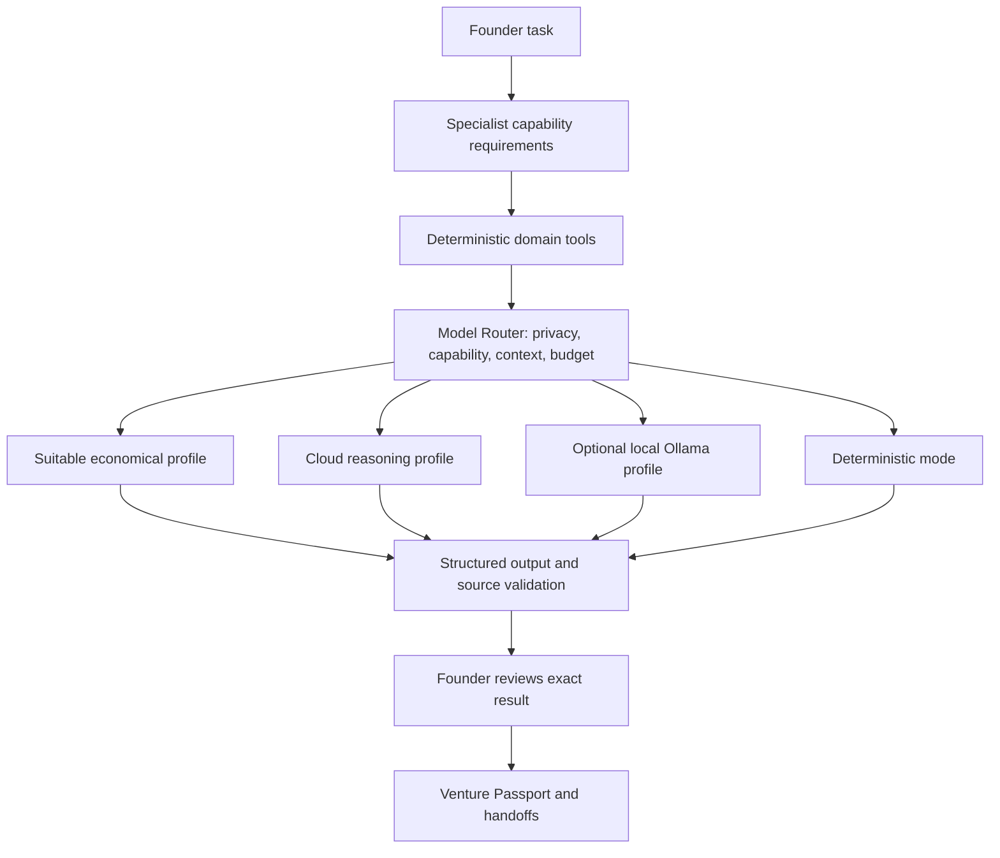

# Provider-agnostic hybrid model layer

Venture Forge uses **Specialist → capability requirement → Model Router → provider adapter → validated analysis → founder review → Venture Passport**. OpenAI, Anthropic, Gemini and Ollama have separate transport adapters; agent contracts contain no vendor or model names. Deterministic Python remains responsible for calculation, validation, evidence access, workflow state and review gates.

## Routing behavior

Hybrid routing (`AUTO`) is the default. For high-reasoning tasks, the router prefers an affordable, capable cloud profile over a capable local profile. Other tasks choose a suitable economical profile. Capability requirements include reasoning tier, minimum context, output allowance, structured output and tool-call support. Actual payload size can require a larger context window than the agent's minimum. Selection uses conservative UTF-8 byte bounds, the configured rates and the run cost cap.

`RULE` always uses deterministic tools at zero model cost. `MODEL` requires a suitable configured profile. With no ready profiles, AUTO explicitly records `NO_MODEL_CONFIGURED` and runs the deterministic tools; it does not claim that model reasoning or synthesis occurred. If profiles exist but cannot meet the task requirements, the run fails rather than quietly using a weaker model. A requested profile must satisfy the same requirements.

`local_only` excludes every cloud profile. There is no automatic privacy relaxation, provider failover or retry after a model request. Local capability/size limits still apply; a private task can fail if its local model is unsuitable. Missing consent, unsupported capabilities, oversized context and insufficient budget produce clear routing errors.

| Specialist | Model task | Reasoning | Minimum context tokens | Tool-call capability required |
| --- | --- | --- | ---: | --- |
| ForgeGuide | Guidance | Standard | 8,192 | No |
| EvidenceScout | Source synthesis | High | 32,768 | Yes |
| MarketMapper | Market interpretation | Standard | 16,384 | No |
| CustomerLens | Observation synthesis | High | 32,768 | No |
| RivalRadar | Alternative synthesis | High | 32,768 | Yes |
| ModelArchitect | Business-model reasoning | High | 16,384 | No |
| FinancePilot | Financial explanation | Standard | 16,384 | No |
| MVPForge | Experiment reasoning | High | 16,384 | No |
| VentureSim | Scenario explanation | Standard | 8,192 | No |
| SkillCoach | Applied guidance | Standard | 8,192 | No |
| EcosystemNavigator | Opportunity diligence | High | 32,768 | Yes |
| InvestorRoom | Funding diligence | High | 32,768 | No |
| PassportKeeper | Accepted-record synthesis | High | 65,536 | No |

The requirements are application policy. Profile capabilities are operator declarations, not automatic model quality benchmarks. Validate a chosen model's actual API compatibility, capacity and reasoning quality before enabling it. Tool-call capability participates in admission; the current workflow executes its allowlisted tools directly in Python and sends tool results to models. Native provider tool loops and live search/retrieval connectors are not activated by this change.

## Configure profiles and keys

1. Copy `config/model-profiles.example.json` to `.local/model-profiles.json`.
2. Choose actual available model IDs. Replace the example capability declarations with verified values, set conservative current INR rates for each cloud profile, and enable the profiles you intend to use. Examples are disabled and contain no deployable model recommendation or current price.
3. In the private server `.env`, set `MODEL_ROUTER_POLICY=hybrid` and `MODEL_PROFILES_FILE=.local/model-profiles.json`. Leave `MODEL_PROFILES=[]`. Alternatively set `MODEL_PROFILES` to a JSON array and omit the file setting.
4. Put `OPENAI_API_KEY`, `ANTHROPIC_API_KEY` and/or `GEMINI_API_KEY` in that server `.env`. Only the enabled providers need keys. For optional Ollama use `OLLAMA_URL=http://127.0.0.1:11434`; only a loopback URL without embedded credentials is admitted.
5. Restart API and worker with `Start-VentureForge.ps1`. In the specialist form, keep Hybrid routing, choose processing policy and cost cap, and explicitly allow processing of that run's scoped context.

No provider key is accepted by browser forms or returned in the catalog, Passport, errors or traces. Never use `NEXT_PUBLIC_` variables for these keys. Cloud readiness also requires positive input/output prices; local rates may be zero. `MODEL_ROUTER_POLICY=disabled` disables all model profiles. The old `MODEL_PROVIDER`/`MODEL_ID` pair is a compatibility profile with standard reasoning; it does not replace per-task capability declarations.

## Synthesis and deterministic boundaries

Research receives supplied scoped receipts, preserves their source IDs, hash, exact excerpt and locator, then uses the selected model for labelled synthesis, a short hypothesis assessment, questions and query suggestions. Source claims must contain quotes that occur in the supplied text and exactly match its locator. Unsupported citations and quotes are rejected. Query suggestions do not trigger a search; live retrieval is still unconnected. Source access, freshness and provenance checks run in code.

Synthesis tasks require a nonempty `synthesis` and `hypothesis_assessment`. When original source text is supplied, at least one claim must include a verified source quote and locator. A generic explanation alone is rejected as `MODEL_ANALYSIS_INCOMPLETE`; missing source claims produce `MODEL_ANALYSIS_UNGROUNDED`. Reasoning and diligence tasks require a hypothesis assessment. Omitted source text permits explicitly limited analysis with no invented quotes. Explanation/guidance tasks can interpret code outputs without inventing a source synthesis.

The prompt focuses on supporting and contrary findings, alternative explanations, uncertainty and a proposed falsifiable next test. It asks for conclusions and evidence, without intermediate thinking, consistent with [OpenAI Docs reasoning guidance](https://developers.openai.com/api/docs/guides/reasoning-best-practices). Supplied source IDs define the citable material, consistent with [official citation guidance](https://developers.openai.com/api/docs/guides/citation-formatting). Local checks enforce presence and provenance; semantic quality still needs founder review. The trace records the `synthesis-first-v1` analysis policy. Model analysis and artifact acceptance cannot independently validate a hypothesis or complete an observed learning cycle.

Finance calculations use Decimal-based Python functions for CAC, revenue/gross-profit LTV, runway, gross margin, cash change and ending cash. Optional customer drivers stay unknown when absent; the model cannot supply missing numerical assumptions or replace calculated figures. The finance output contract checks its figures against the recorded drivers. See [formulas, units and missing-input behavior](finance-tools.md). The router receives those results for interpretation. Simulation remains SIMULATED. Financial-model context omits original interview text, including nested source excerpts in upstream artifacts. Models receive no Passport write, email, payment, shell or external-action tools.

All model analysis stays under `data.model_assistance`, labelled `MODEL_INFERENCE`. Exact quote matching establishes provenance, not semantic support or truth. Founder review is still required before the output becomes an accepted artifact or handoff.

## Provider adapters and evidence

The OpenAI adapter uses the [Responses structured-output API](https://developers.openai.com/api/docs/guides/structured-outputs), with a strict schema and `store=false`. Anthropic uses [Messages structured outputs](https://platform.claude.com/docs/en/build-with-claude/structured-outputs) through `output_config.format`. Gemini uses [generateContent](https://ai.google.dev/api/generate-content) with [JSON-schema output](https://ai.google.dev/gemini-api/docs/generate-content/structured-output), passing its key in a header. Optional Ollama uses the [chat API](https://docs.ollama.com/api/chat) with an output schema and streaming disabled. All responses are normalized and validated locally.

Every successful or failed provider attempt records its profile, routing reason, capability requirement, cost reservation, price snapshot and available usage. Provider-reported usage is distinct from an estimate when usage is unknown. Keys, provider error bodies and partial invalid analysis are not logged. Refusal, truncation and timeouts fail without automatic retry. Cancellation prevents publication while preserving usage already incurred. Configured estimates are not a provider billing guarantee; cached/reasoning-token pricing can require conservative operator rates.

Files: `shared/model_config.py`, `product/agents/model_router.py`, `provider_adapters.py`, `gateway.py`, `registry.py` and `runtime.py`. The catalog exposes public profile metadata and agent requirements. The tool trace shows the actual routing decision.

Verification uses isolated databases and mocked provider transports; no live model request or paid API validation was made during development.
