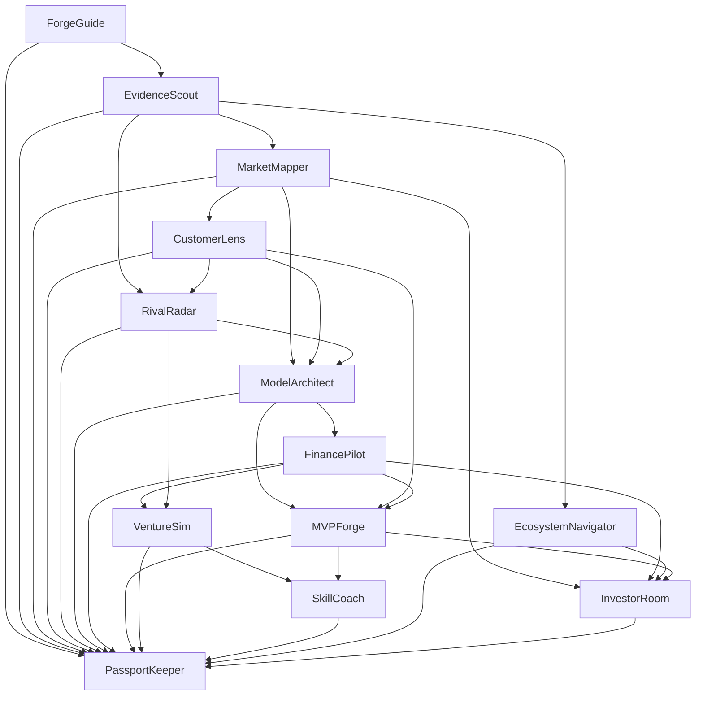

# Specialist pipelines

Implemented from the user's `VentureForge13SpecialistApplications.pdf` (75 pages), alongside the earlier tool-first architecture. The documents describe the design; embedded prompts do not override the user's request or authorize external actions.

## Use the application

Start `../Start-VentureForge.ps1` from the parent folder, sign in at http://127.0.0.1:3000 and create a venture with a testable hypothesis. Add original receipts in Research Desk and consented observations in Customer Lab.

In **Agent Pipelines**, create a journey and open a READY stage. Its accepted prerequisites travel automatically. Choose further records for the same hypothesis and enter the requested parameters. Research needs a receipt; customer synthesis needs an actual consented interview; competition needs a named alternative; finance and market require numerical drivers; ecosystem matching needs supplied official programme records. Missing information produces NEEDS INPUT rather than fabricated success.

Run the specialist. Review its output, unknowns, provenance, calculations and next action. Accept with a rationale to create a canonical Passport artifact and destination handoffs. Reject to block the branch, or cancel pending work. Failed, cancelled, rejected and stale stages can be rerun once their prerequisites are accepted. A changed concept or withdrawn source invalidates dependent outputs transitively. A new journey preserves the old journey's history.

Acceptance does not independently verify a claim, record a sale, lock an experiment or complete a real learning cycle. Use the existing Experiment Lab approval and observation controls for those actions. Simulation stays SIMULATED and academy work stays PRACTICE. InvestorRoom produces a checklist and reconciled views, not outreach or investment likelihood.

## Connected journeys

| Journey | Connected stages |
| --- | --- |
| Raw idea to first evidence | ForgeGuide → EvidenceScout → CustomerLens → ModelArchitect → MVPForge → PassportKeeper |
| Evidence-led pivot | Guide → research → customer and alternatives → business model → finance → experiment → Passport |
| Founder learning | Guide → SkillCoach → research → customer → model → experiment → Passport |
| Funding preparation | Guide → research → market → model → finance; research → ecosystem; accepted market/finance/ecosystem → InvestorRoom → Passport |
| All thirteen | All specialists, with the dependencies below |

The learning journey supports an individual founder. The PDF's institutional/college journey additionally requires cohort, mentor, reviewer and institution roles that are not implemented here.

## Contracts and persistence

`product/agents/registry.py` defines the thirteen specialists, parameter schemas, tool allowlists, inputs, handoff destinations and exact DAGs. `outputs.py` validates the thirteen domain output shapes. `schemas.py` validates request budgets, output identity and review hashes. `runtime.py` builds scoped snapshots, fingerprints source and artifact versions, claims queued work, validates results and propagates staleness. Full interview excerpts are omitted from economics context, including nested upstream source text.

Declared journey edges extend the PDF's base handoff matrix, including the SkillCoach research referral. The published receive/send policies and review-created handoffs use that same registry. SkillCoach can additionally receive an accepted finance artifact for numeric practice feedback.

Migrations 0003 and 0004 add scoped pipelines, stages, specialist runs, handoffs and worker claim time. API writes check founder ownership, revision and idempotency. Hash-bound review prevents accepting a different proposal. Accepted prerequisite artifacts are required before a stage can run. Running work past its time cap plus 120 seconds becomes FAILED / WORKER INTERRUPTED, allowing a supervised rerun without automatically repeating a paid provider request.

| API | Purpose |
| --- | --- |
| `GET /api/v1/agents` | Specialist catalog, input schemas, templates and model availability |
| `POST /api/v1/ventures/{id}/pipelines` | Create a scoped journey with review gates |
| `POST /api/v1/ventures/{id}/agent-runs` | Queue a bounded specialist mission |
| `GET /api/v1/ventures/{id}/agent-runs/{run_id}` | Read its status, proposal and trace |
| `POST .../agent-runs/{run_id}/review` | Accept/reject the exact result hash |
| `POST .../agent-runs/{run_id}/cancel` | Cancel and discard late publication |
| `GET /api/v1/ventures/{id}/passport` | Current scoped records, pipelines and handoffs |

## Hybrid model routing

Hybrid routing (`AUTO`) is the default. Each specialist declares its reasoning, context, output and tool-call requirements. The router prefers capable cloud profiles for complex tasks, chooses economical profiles for simpler work, and admits only local profiles for a local-only request. OpenAI, Anthropic, Gemini and Ollama use separate adapters. No specialist is bound to a provider.

Configure server profiles and private keys following the [model routing guide](model-routing.md), then restart API/worker. Model processing requires the founder's per-run consent and cost cap. Deterministic (`RULE`) mode costs ₹0 and needs no model account. With no ready profiles, AUTO records a deterministic fallback and explicitly leaves model synthesis unavailable. A configured profile that cannot satisfy the task is rejected.

Python performs domain calculations, evidence access, validation and workflows. Model synthesis, hypothesis assessment, questions and query suggestions appear as separate MODEL INFERENCE analysis. Source claims must preserve exact quotes and locators; unsupported references are rejected. Models cannot replace finance calculations or write Passport records. Native provider tool loops and live source retrieval remain unconnected.

Before a provider request, the adapter reserves a conservative input/output estimate against the run cap. The trace records configured price snapshots and provider-reported usage. Failed/unknown-usage requests retain a reserved estimate, explicitly labelled as such. These are configured cost controls, not a provider billing guarantee. Invalid output, refusal, unsupported citations and timeouts produce a sanitized failure and are not retried automatically. Provider text cannot alter the underlying tool calculation.

All four adapters were verified with mocked transports. No live provider request, external account connection, programme fetch, email or payment was made during this build.

## Verification

Fifty-eight isolated portable API tests cover all five journeys, all thirteen specialists, exact review gates, zero-cost rules, consent/source scope, source injection as data, staleness, cancellation during execution, interruption recovery, four provider transports, capability/privacy/context/cost/step routing, source quote checks, required synthesis/hypothesis assessment, incomplete-analysis rejection, hypothesis preservation, profile files, deterministic CAC/LTV and cash cases, tampered financial output, simulation propagation and migration preservation/rollback. Three browser journeys cover the original foundation, real negative experiments, and the thirteen-stage reviewed pipeline with desktop/mobile rendering, customer metrics, precise decimal requests and reload. Hybrid controls additionally use a configured public-catalog fixture without paid calls. PostgreSQL and real-provider integration still require their configured services.
